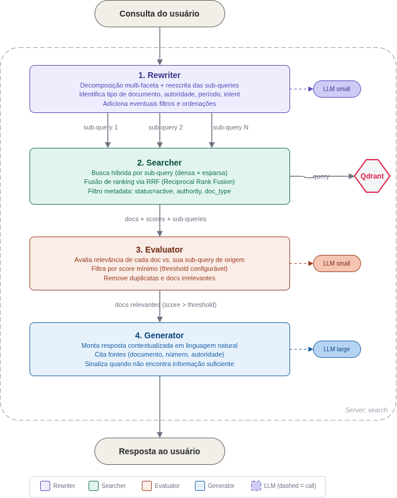
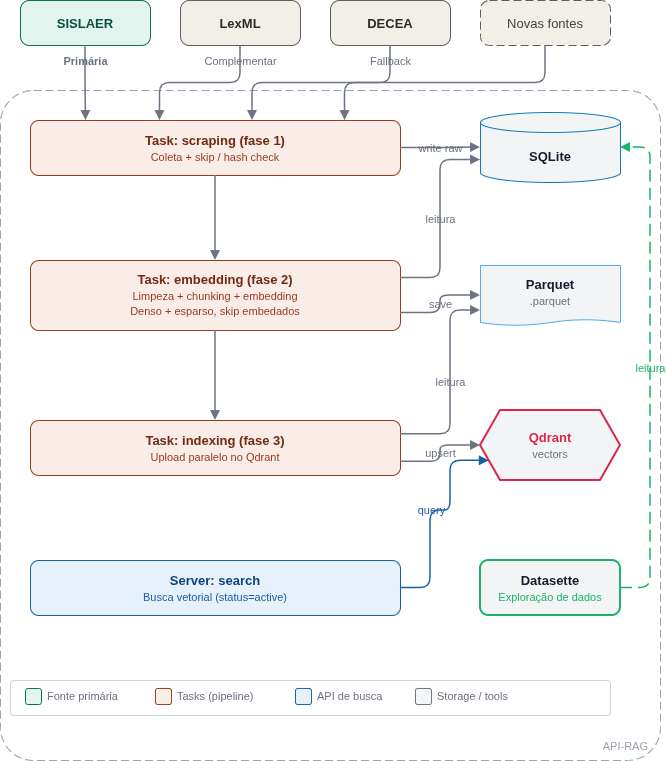

# Documentação Completa - Aviation RAG System

> Documentação detalhada de todo o sistema Aviation RAG. Para um guia rápido, consulte o [QUICKSTART.md](QUICKSTART.md). Para uma introdução, consulte o [START_HERE.md](START_HERE.md).

---

## Índice

1. [Visão Geral do Sistema](#1-visão-geral-do-sistema)
2. [Pré-requisitos e Dependências Externas](#2-pré-requisitos-e-dependências-externas)
3. [Configuração Central (.env)](#3-configuração-central-env)
4. [Banco Vetorial (Qdrant)](#4-banco-vetorial-qdrant)
5. [Modelo de Embeddings (Legal-BERTimbau)](#5-modelo-de-embeddings-legal-bertimbau)
6. [LLM (Ollama)](#6-llm-ollama)
7. [Extração de Documentos Normativos](#7-extração-de-documentos-normativos)
8. [Pipeline de Ingestão](#8-pipeline-de-ingestão)
9. [API RAG (Backend)](#9-api-rag-backend)
10. [Interface Web (Frontend)](#10-interface-web-frontend)
11. [Scripts Utilitários](#11-scripts-utilitários)
12. [Avaliação de Qualidade](#12-avaliação-de-qualidade)
13. [Testes e Automação (Makefile)](#13-testes-e-automação-makefile)
14. [Deploy em Produção (systemctl + Nginx)](#14-deploy-em-produção-systemctl--nginx)
15. [GPU Inference Server (Remoto)](#15-gpu-inference-server-remoto)
16. [Resolução de Problemas](#16-resolução-de-problemas)

---

## 1. Visão Geral do Sistema

O Aviation RAG System é uma plataforma que combina:

- **Busca semântica vetorial** — Encontra trechos de documentos similares à pergunta do usuário usando embeddings (dense vectors)
- **Busca por keywords (opcional)** — Busca BM25 via sparse vectors para termos exatos, siglas e referências a artigos
- **Busca híbrida (opcional)** — Combina busca semântica + keywords usando Reciprocal Rank Fusion (RRF)
- **Geração aumentada por recuperação (RAG)** — Usa os trechos recuperados como contexto para um LLM gerar respostas fundamentadas
- **Chat conversacional** — Mantém histórico de conversa por sessão, com streaming em tempo real

### Arquitetura do Search Pipeline (RAG Modular)

O pipeline RAG é modular, composto por 4 estágios independentes orquestrados pelo `RAGPipeline`:



| Estágio | Descrição | Módulo |
|---------|-----------|--------|
| **1. Rewriter** | Reescreve a consulta do usuário em 1..N sub-queries otimizadas usando um LLM menor. Adiciona filtros e sorts quando detecta intenção temporal/tipo de documento. | `search/rewriter/` |
| **2. Searcher** | Executa buscas vetoriais em paralelo para cada sub-query. Converte filtros do schema em filtros nativos Qdrant. Deduplica resultados. | `search/searcher/` |
| **3. Evaluator** | Avalia a relevância de cada documento usando um modelo cross-encoder (0-100). Filtra por threshold configurável. | `search/evaluator/` |
| **4. Generator** | Gera a resposta final contextualizada com referências às fontes. Suporta modo grounded (apenas documentos) ou ungrounded (com conhecimento prévio). | `search/generator/` |

O pipeline possui um **modo debug** ativável por request que retorna um `PipelineTrace` completo com queries reescritas, scores de avaliação, documentos aceitos/descartados e tempos de cada estágio.

### Arquitetura do Indexing Pipeline

O pipeline de ingestão é composto por 3 fases que extraem, processam e indexam documentos regulatórios:



| Fase | Descrição | Fontes |
|------|-----------|--------|
| **Fase 1: Scraping** | Coleta documentos das fontes com skip/hash check | SISLAER, LexML, DECEA |
| **Fase 2: Embedding** | Limpeza, chunking e geração de embeddings (denso + esparso) | SQLite → Parquet |
| **Fase 3: Indexing** | Upload paralelo dos vetores no Qdrant | Parquet → Qdrant |

### Componentes do sistema:

| Componente | Tecnologia | Localização |
|-----------|------------|-------------|
| Configuração central | Pydantic Settings | `config.py` |
| API RAG | FastAPI | `api/server.py` |
| Busca vetorial | Qdrant Client | `search/vector_search.py` |
| Pipeline RAG (orquestrador) | Modular Pipeline | `search/orchestrator/pipeline.py` |
| Rewriter | LLM query rewriting | `search/rewriter/` |
| Searcher | Parallel vector search | `search/searcher/` |
| Evaluator | Cross-encoder reranking | `search/evaluator/` |
| Generator | LLM response generation | `search/generator/` |
| Schemas compartilhados | Pydantic models | `search/shared/schemas.py` |
| Exceções do pipeline | Custom exceptions | `search/shared/exceptions.py` |
| Embeddings | Legal-BERTimbau (sentence-transformers) | `models/embeddings.py` |
| LLM | Ollama (llama3, phi3, etc.) | `models/llm.py` |
| Banco vetorial | Qdrant | `database/qdrant_manager.py` |
| Scraper base (ABC) | Interface async + registry | `crawler/scrapers/base.py` |
| Scraper SISLAER | aiohttp (async) + Search API + BeautifulSoup | `crawler/scrapers/sislaer_scraper.py` |
| Scraper DECEA | Requests + BeautifulSoup (async via to_thread) | `crawler/scrapers/decea_scraper.py` |
| Scraper LexML | aiohttp (async) + BeautifulSoup | `crawler/scrapers/lexml_scraper.py` |
| Scraper PDF (local) | PDFParser (pdfplumber/PyMuPDF) | `crawler/scrapers/pdf_scraper.py` |
| Document Store | SQLite registry + change detection | `pipeline/document_store.py` |
| Embedding Store | Parquet-backed vector storage | `pipeline/embedding_store.py` |
| Avaliação (retrieval) | Golden Set + Métricas IR | `evaluation/evaluate_retrieval.py` |
| Avaliação (geração) | Heurísticas de qualidade LLM | `evaluation/evaluate_generation.py` |
| Interface Web | FastAPI + Jinja2 | `web/main.py` |

---

## 2. Pré-requisitos e Dependências Externas

### 2.1. Pacotes de sistema (Ubuntu/Debian)

```bash
sudo apt update
sudo apt install -y python3 python3-venv python3-pip build-essential git curl
```

### 2.2. Docker (para Qdrant)

```bash
# Instalar Docker Engine
sudo apt install -y ca-certificates curl gnupg
sudo install -m 0755 -d /etc/apt/keyrings
curl -fsSL https://download.docker.com/linux/ubuntu/gpg | sudo gpg --dearmor -o /etc/apt/keyrings/docker.gpg
echo "deb [arch=$(dpkg --print-architecture) signed-by=/etc/apt/keyrings/docker.gpg] \
  https://download.docker.com/linux/ubuntu $(. /etc/os-release && echo "$VERSION_CODENAME") stable" | \
  sudo tee /etc/apt/sources.list.d/docker.list > /dev/null
sudo apt update
sudo apt install -y docker-ce docker-ce-cli containerd.io

# Permitir uso sem sudo (requer re-login)
sudo usermod -aG docker $USER

# Iniciar Qdrant
docker run -d --name qdrant --restart always \
  -p 6333:6333 -p 6334:6334 \
  -v $(pwd)/qdrant_storage:/qdrant/storage \
  qdrant/qdrant

# Verificar
curl http://localhost:6333/healthz
```

### 2.3. GPU — NVIDIA Drivers + CUDA (para servidor com GPU)

```bash
# Instalar drivers NVIDIA (ajustar versão conforme hardware)
sudo apt install -y nvidia-driver-535

# Reiniciar e verificar
sudo reboot
nvidia-smi

# Verificar modelo da GPU e memória
nvidia-smi --query-gpu=name,driver_version,memory.total --format=csv,noheader
```

O PyTorch (incluído no `requirements.txt`) detecta CUDA automaticamente. Após instalar as dependências Python, confirme:

```bash
python3 -c "import torch; print(f'CUDA: {torch.cuda.is_available()}, GPU: {torch.cuda.get_device_name(0) if torch.cuda.is_available() else \"N/A\"}')"
```

### 2.4. Ollama (LLM local)

```bash
# Instalar
curl -fsSL https://ollama.com/install.sh | sh

# Baixar modelo
ollama pull llama3.2:3b

# Verificar
ollama list
systemctl status ollama
```

### 2.5. nginx (reverse proxy)

```bash
sudo apt install -y nginx
sudo systemctl enable nginx
```

### 2.6. Serviços em produção

| Serviço | Porta | Verificação |
|---------|-------|-------------|
| **Qdrant** | 6333 | `curl http://localhost:6333/healthz` |
| **Ollama** | 11434 | `ollama list` |
| **API RAG** | 8083 | `curl http://127.0.0.1:8083/health` |
| **Web App** | 8082 | `curl http://127.0.0.1:8082/health` |
| **Datasette** | 8001 | `curl http://127.0.0.1:8001/explore/` |
| **nginx** | 80 | `curl http://localhost/ragweb/health` |

### 2.7. Verificação rápida de todos os pré-requisitos

```bash
make check
```

### 2.8. Instalação das dependências Python

```bash
cd aviation-rag-system/
python3 -m venv venv
source venv/bin/activate
pip install -r requirements.txt

cd web/
python3 -m venv venv
source venv/bin/activate
pip install -r requirements.txt
```

---

## 3. Configuração Central (.env)

Toda a configuração do sistema é centralizada no arquivo `.env` na raiz do projeto, carregada pela classe `Settings` em `config.py`.

### Como configurar:

```bash
cp env.example .env
# Edite o .env
```

### Referência completa de variáveis:

#### Segurança da API

| Variável | Tipo | Padrão | Descrição |
|----------|------|--------|-----------|
| `API_KEY` | string | — | **Obrigatório.** Chave de autenticação. Gere com: `python -c "import secrets; print(secrets.token_urlsafe(32))"` |
| `CORS_ORIGINS` | string | `http://localhost:3000,http://localhost:8080` | Origens permitidas (separadas por vírgula) |
| `RATE_LIMIT` | int | `100` | Limite de requisições por minuto |

#### Qdrant

| Variável | Tipo | Padrão | Descrição |
|----------|------|--------|-----------|
| `QDRANT_HOST` | string | `localhost` | Host do servidor Qdrant |
| `QDRANT_PORT` | int | `6333` | Porta do Qdrant |
| `QDRANT_COLLECTION_NAME` | string | `aviation_regulations` | Nome da coleção |
| `QDRANT_API_KEY` | string | — | Chave API (apenas para Qdrant Cloud) |

#### Ollama / LLM

| Variável | Tipo | Padrão | Descrição |
|----------|------|--------|-----------|
| `OLLAMA_HOST` | string | `http://localhost:11434` | URL do servidor Ollama |
| `OLLAMA_MODEL` | string | `llama3.1:8b` | Modelo LLM padrão |
| `LLM_TEMPERATURE` | float | `0.3` | Temperatura de geração (0=determinístico, 2=criativo) |
| `LLM_TOP_P` | float | `0.9` | Nucleus sampling |
| `LLM_MAX_TOKENS` | int | `2048` | Máximo de tokens por resposta |

#### Modelo de Embeddings

| Variável | Tipo | Padrão | Descrição |
|----------|------|--------|-----------|
| `EMBEDDING_MODEL` | string | `rufimelo/Legal-BERTimbau-sts-large-ma-v3` | Modelo HuggingFace |
| `EMBEDDING_BATCH_SIZE` | int | `32` | Batch size para encoding |
| `EMBEDDING_MAX_LENGTH` | int | `512` | Comprimento máximo de sequência |
| `EMBEDDING_DIMENSION` | int | `1024` | Dimensão dos vetores |

#### Busca

| Variável | Tipo | Padrão | Descrição |
|----------|------|--------|-----------|
| `SEARCH_TOP_K` | int | `8` | Número de resultados retornados por query |
| `SEARCH_SCORE_THRESHOLD` | float | `0.3` | Score mínimo de similaridade. Sem efeito em modo híbrido (RRF) |
| `SEARCH_DENSE_ENABLED` | bool | `true` | Habilita busca semântica (dense vectors) |
| `SEARCH_SPARSE_ENABLED` | bool | `true` | Habilita busca por keywords/BM25 (sparse vectors via fastembed) |
| `SPARSE_EMBEDDING_MODEL` | string | `Qdrant/bm25` | Modelo de sparse embeddings (usado quando `SEARCH_SPARSE_ENABLED=true`) |
| `SEARCH_PREFETCH_MULTIPLIER` | int | `3` | RRF prefetch pool size per branch in hybrid mode = `SEARCH_TOP_K * mul`. |
| `SEARCH_SORT_FETCH_MULTIPLIER` | int | `3` | When a sub-query carries a sort, fetch `SEARCH_TOP_K * mul` candidates, sort in-memory, then cap back to the pool size. |
| `DEFAULT_EMBEDDING_MODE` | string | `hybrid` | Modo padrão para `make embed` (`dense`, `sparse`, `hybrid`) |
| `HNSW_M` | int | `16` | Parâmetro M do índice HNSW |
| `HNSW_EF_CONSTRUCT` | int | `100` | Parâmetro ef_construct do HNSW |
| `HNSW_EF_SEARCH` | int | `64` | Parâmetro ef para busca no HNSW |

> **Busca híbrida:** Quando ambos `SEARCH_DENSE_ENABLED` e `SEARCH_SPARSE_ENABLED` estão habilitados, o sistema combina os resultados usando Reciprocal Rank Fusion (RRF) via Qdrant Query API. Isso melhora a recuperação de termos exatos (siglas, artigos, nomes de ICAs) que a busca semântica pura pode perder. A coleção deve ser recriada ao habilitar sparse pela primeira vez (`make index RECREATE=1`).

#### Chunking

| Variável | Tipo | Padrão | Descrição |
|----------|------|--------|-----------|
| `CHUNK_MAX_TOKENS` | int | `512` | Máximo de tokens por chunk |
| `CHUNK_OVERLAP` | int | `50` | Overlap entre chunks (tokens) |

#### Servidor da API

| Variável | Tipo | Padrão | Descrição |
|----------|------|--------|-----------|
| `API_HOST` | string | `127.0.0.1` | Host do servidor API |
| `API_PORT` | int | `8083` | Porta do servidor API |
| `RELOAD` | bool | `true` | Hot-reload em desenvolvimento |

#### LexML

| Variável | Tipo | Padrão | Descrição |
|----------|------|--------|-----------|
| `LEXML_API_URL` | string | `https://www.lexml.gov.br/sru` | URL da API LexML |
| `LEXML_KEYWORDS` | string | `aviação,aeronave,ANAC,...` | Palavras-chave para busca |
| `LEXML_MAX_RATE` | int | `5` | Máximo de requisições por segundo (rate limiting do scraper async) |

---

## 4. Banco Vetorial (Qdrant)

O Qdrant é o banco de dados vetorial que armazena os embeddings dos documentos normativos. Ele permite buscas por similaridade semântica e filtros temporais.

### 4.1. Inicialização

O Qdrant precisa estar rodando antes de qualquer operação. A forma mais simples é via Docker:

```bash
docker run -d --name qdrant \
  -p 6333:6333 -p 6334:6334 \
  -v $(pwd)/qdrant_storage:/qdrant/storage \
  qdrant/qdrant
```

### 4.2. Criação da coleção

A coleção é criada automaticamente pela fase de indexação:

```bash
make index RECREATE=1
```

Isso cria a coleção `aviation_regulations` com:
- Vetores de **1024 dimensões** (dimensão do Legal-BERTimbau)
- Distância **Cosine**
- Índice HNSW otimizado (M=16, ef_construct=100)
- Índices de payload para: `regulation_id`, `effective_date`, `expiry_date`, `source`, `doc_type`

### 4.3. Operações do QdrantManager

A classe `QdrantManager` (`database/qdrant_manager.py`) encapsula todas as operações:

| Método | Descrição |
|--------|-----------|
| `create_collection()` | Cria a coleção com índices |
| `upsert_points()` | Insere/atualiza vetores |
| `search()` | Busca por similaridade |
| `search_temporal()` | Busca com filtro de data |
| `get_collection_info()` | Estatísticas da coleção |
| `delete_collection()` | Remove a coleção |

### 4.4. Inspeção

Para inspecionar os dados no Qdrant:

```bash
python -m scripts.inspect_qdrant
```

Este script mostra:
- Informações da coleção (total de vetores, status)
- Estrutura dos campos (payload) de cada registro
- Exemplos de dados armazenados

### 4.5. Backup e Restore (Snapshots)

O Qdrant suporta **snapshots** nativamente — uma cópia binária completa da collection (vetores, payloads, índices HNSW). Restaurar um snapshot é **ordens de magnitude mais rápido** que re-gerar embeddings e re-indexar (~segundos vs. horas).

#### Criar backup

```bash
make backup
```

Isso cria um snapshot da collection e salva em `data/backups/`:

```
Creating Qdrant snapshot for 'aviation_regulations' …
Snapshot created: aviation_regulations-2026-04-05-18-30-00.snapshot
Downloading to data/backups/aviation_regulations-2026-04-05-18-30-00.snapshot …
Backup saved: data/backups/aviation_regulations-2026-04-05-18-30-00.snapshot (1.2G)
Restore with: make restore FILE=data/backups/aviation_regulations-2026-04-05-18-30-00.snapshot
```

#### Restaurar backup

```bash
make restore FILE=data/backups/aviation_regulations-2026-04-05-18-30-00.snapshot
```

Para listar snapshots disponíveis:

```bash
make restore   # sem FILE= lista os backups existentes
```

#### Quando usar

| Cenário | Recomendação |
|---------|-------------|
| Antes de `make index RECREATE=1` | `make backup` — permite voltar atrás se algo der errado |
| Migrar para novo servidor | `make backup` → copiar `.snapshot` → `make restore FILE=...` |
| Após indexação bem-sucedida | `make backup` — evita re-executar `embed` + `index` futuramente |
| Re-deploy rápido | `make restore` em vez de `make embed FORCE=1 && make index RECREATE=1` |

#### Notas técnicas

- O snapshot inclui **tudo**: vetores densos, esparsos, payloads, configuração HNSW e índices de payload.
- A collection de destino é **sobrescrita** pelo restore — dados existentes são substituídos.
- O restore usa a API de **upload multipart** do Qdrant, portanto funciona tanto com Qdrant em Docker quanto instalado nativamente — não depende de paths compartilhados.
- Snapshots podem ser grandes (~1-2 GB para ~400K pontos com vetores de 1024 dims). Certifique-se de ter espaço em disco.
- Para backup/restore em outro host Qdrant, ajuste `QDRANT_HOST`:

```bash
make backup QDRANT_HOST=192.168.1.100
make restore QDRANT_HOST=192.168.1.100 FILE=data/backups/meu-backup.snapshot
```

#### Fluxo recomendado para próximas vezes

Na primeira vez, execute o pipeline completo:

```bash
make pipeline MODE=hybrid RECREATE=1    # collect + embed + index (pode levar horas)
make backup                             # salvar snapshot após sucesso
```

Nas próximas vezes (novo servidor, re-deploy, ou recovery):

```bash
make restore FILE=data/backups/aviation_regulations-YYYY-MM-DD.snapshot   # segundos
```

### 4.6. Reset completo

Para apagar todos os dados e recriar a coleção:

```bash
make index RECREATE=1
```

Para forçar re-coleta e reconstrução completa:

```bash
make collect FORCE=1    # apaga docs da store e re-coleta
make embed FORCE=1      # re-gera todos os embeddings
make index RECREATE=1   # recria a coleção no Qdrant
```

---

## 5. Modelo de Embeddings (Legal-BERTimbau)

O sistema usa o modelo **rufimelo/Legal-BERTimbau-sts-large-ma-v3**, um modelo de sentence-transformers treinado especificamente para textos jurídicos em português brasileiro.

### Características:

| Propriedade | Valor |
|-------------|-------|
| Modelo base | BERTimbau Large |
| Treinamento | Textos jurídicos em PT-BR |
| Dimensão dos vetores | 1024 |
| Max sequence length | 512 tokens |
| Distância | Cosine similarity |

### Como funciona:

A classe `EmbeddingModel` (`models/embeddings.py`) carrega o modelo na inicialização e oferece:

```python
from models.embeddings import EmbeddingModel

model = EmbeddingModel()

# Encoding de um texto
vector = model.encode("Quais são os requisitos para pilotos?")
# Retorna: numpy array de shape (1024,)

# Encoding em batch
vectors = model.encode(["texto 1", "texto 2", "texto 3"])
# Retorna: numpy array de shape (3, 1024)
```

### GPU vs CPU:

- O modelo detecta automaticamente se CUDA está disponível
- Com **GPU**: encoding rápido (~100 textos/segundo)
- Com **CPU**: encoding lento (~5 textos/segundo), mas funcional
- Com **`INFERENCE_MODE=remote`**: delegação para GPU remoto via HTTP (veja [seção 15](#15-gpu-inference-server-remoto))

O cache do modelo é armazenado em `models_cache/`.

> **Pré-download:** O modelo de embeddings é baixado automaticamente com `make download-models` (veja [seção abaixo](#pré-download-de-modelos)).

---

## 6. LLM (Ollama)

O sistema usa **Ollama** para rodar modelos de linguagem localmente. O Ollama gerencia o download, carregamento e execução dos modelos.

### 6.1. Instalação e configuração

```bash
# Instalar Ollama
curl -fsSL https://ollama.com/install.sh | sh

# Baixar modelos (via Makefile — recomendado)
make download-models

# Ou manualmente:
ollama pull gemma4:26b     # Generator (modelo principal)
ollama pull qwen2.5:7b     # Rewriter (reescrita de queries)
```

### 6.2. Modelos suportados

Qualquer modelo disponível no Ollama funciona. O modelo padrão é configurado em `OLLAMA_MODEL` no `.env`. Modelos testados:

| Modelo | Tamanho | Uso no pipeline | Observação |
|--------|---------|-----------------|------------|
| `qwen2.5:7b` | ~4.7GB | Rewriter (padrão) | Boa qualidade de reescrita, respeita filtros |
| `gemma4:26b` | ~17GB | **Generator (padrão)** | Vencedor do A/B vs `qwen2.5:14b` (100% citation grounding em E2E, ~5s med. latência, +108% citações por resposta, zero alucinações) |
| `qwen2.5:14b` | ~9GB | Generator (alt.) | Baseline anterior. Disponível via UI/API change endpoint |
| `llama3.1:70b` | ~40GB | Generator (GPU) | Maior, requer GPU com ~48GB VRAM |
| `llama3.2:3b` | ~2GB | Alternativa leve | Para ambientes com recursos limitados |

### 6.3. Troca de modelo em tempo real

A API permite trocar o modelo LLM em tempo de execução, sem reiniciar o servidor:

```bash
curl -X POST -H "X-API-Key: SUA_CHAVE" -H "Content-Type: application/json" \
  -d '{"model_name": "llama3.1:8b"}' \
  http://127.0.0.1:8083/api/models/change
```

Na interface web, há um dropdown na sidebar do chat para trocar o modelo.

### 6.4. Classe LlamaModel

A classe `LlamaModel` (`models/llm.py`) oferece:

| Método | Descrição |
|--------|-----------|
| `generate()` | Geração de texto com prompt simples (suporta streaming) |
| `generate_with_context()` | Geração RAG (prompt + contexto de documentos) |
| `chat()` | Chat com histórico de mensagens (suporta streaming) |

### 6.5. Pré-download de modelos {#pré-download-de-modelos}

Todos os modelos ML (embeddings, cross-encoder, Ollama) podem ser baixados de uma vez antes de iniciar o servidor:

```bash
make download-models                       # Baixa tudo (embeddings + cross-encoder + Ollama)
make download-models SKIP_OLLAMA=1         # Apenas modelos HuggingFace
make download-models SKIP_EMBEDDINGS=1     # Pula modelo de embeddings
make download-models SKIP_CROSS_ENCODER=1  # Pula cross-encoder
```

O script `scripts/download_models.py` baixa:

| Modelo | Tipo | Usado por |
|--------|------|-----------|
| `rufimelo/Legal-BERTimbau-sts-large-ma-v3` | Sentence-Transformer | Embedding (busca vetorial) |
| `BAAI/bge-reranker-base` | Cross-Encoder | Evaluator (re-ranking) |
| `gemma4:26b` | Ollama LLM | Generator (geração de respostas) |
| `qwen2.5:7b` | Ollama LLM | Rewriter (reescrita de queries) |

> **Dica:** Execute `make download-models` após clonar o repositório ou alterar modelos no `.env`. O deploy (`make deploy`) já faz o download automático dos modelos HuggingFace.

---

## 7. Extração de Documentos Normativos

O sistema extrai documentos de três fontes, com SISLAER como primária:

### 7.1. SISLAER (Fonte Primária)

**Scraper:** `crawler/scrapers/sislaer_scraper.py`

O scraper SISLAER é a fonte primária de documentos legislativos aeronáuticos. Usa a **Search API interna** do portal CENDOC/Sophia (`sislaer.fab.mil.br/TerminalWebCENDOC`) para descoberta rápida de documentos, com **aiohttp (assíncrono)** + BeautifulSoup para extração de conteúdo. Ele:

1. Consulta a Search API (`POST Busca/RapidaLegislacao`) por tipo de norma, com paginação automática (`Resultado/CarregarPaginaLayoutDetalhe`)
2. Cobre 38 tipos de documento (ICA, DCA, Portaria, Lei, Decreto, NSCA, etc.)
3. Gerencia sessão CSRF automaticamente (token + cookies), com renovação em caso de expiração
4. Extrai metadados ricos: situação (Em vigor/Revogado), portaria de aprovação, autoridade, publicação
5. Captura relacionamentos entre documentos (alterações, correlações, revogações) como grafo
6. Extrai conteúdo em prioridade: texto integral inline > VisualizadorHtml > PDF (fallback)
7. Gera `canonical_id` para deduplicação cross-source (ex: `ica_100-12`)
8. Armazena conteúdo, metadados e relações no SQLite (`data/store.db`)

Um fallback via varredura de `codigoRegistro` IDs está disponível para debugging via `strategy="ids"`.

**Como executar:**

```bash
make collect                                          # SISLAER + LexML (padrão)
make collect SOURCES=sislaer                          # Apenas SISLAER
make collect SOURCES=sislaer DOC_TYPES=ICA            # Apenas ICAs do SISLAER
make collect SOURCES=sislaer DOC_TYPES=ICA,DCA,NSCA   # Múltiplos tipos
make collect SOURCES=sislaer LIMIT=50                 # Limita a 50 docs
make collect SOURCES=sislaer CHECK=1                  # Verifica alterações
make collect SOURCES=sislaer FORCE=1                  # Re-coleta do zero
make collect-sislaer                                  # Atalho: apenas SISLAER
```

**Configuração (`env.example`):**

| Variável | Default | Descrição |
|----------|---------|-----------|
| `SISLAER_MAX_RATE` | `10` | Requisições por segundo |
| `SISLAER_CONCURRENCY` | `10` | Conexões simultâneas |
| `SISLAER_TIMEOUT` | `30` | Timeout HTTP em segundos |
| `SISLAER_START_ID` | `1` | ID inicial para varredura (apenas `strategy=ids`) |
| `SISLAER_END_ID` | `0` (auto) | ID final para varredura (apenas `strategy=ids`) |
| `SISLAER_DOC_TYPES` | `ICA,DCA,...` (36 tipos) | Tipos de documento a coletar. PORTARIA e PORTARIA CONJUNTA excluídas por default (20K+ docs administrativos) |

### 7.2. DECEA (Fallback — Instruções de Comando da Aeronáutica)

**Scraper:** `crawler/scrapers/decea_scraper.py`

O scraper DECEA herda de `BaseScraper` e usa **HTTP direto** (`requests` + `BeautifulSoup`) para acessar o portal de publicações do DECEA (`publicacoes.decea.mil.br`). O portal usa Next.js com Server-Side Rendering, o que permite extrair todo o conteúdo sem navegador. Ele:

1. Parseia o índice de publicações via HTML estático
2. Filtra por tipo de documento (ICA, MCA, PCA, DCA, CIRCEA, NSCA, etc.)
3. Extrai URLs de PDFs assinadas (S3) de cada página de publicação
4. Baixa os PDFs originais em paralelo (via `asyncio.Semaphore` + `to_thread`)
5. Extrai texto dos PDFs (PyMuPDF, pdfplumber, OCR fallback)
6. Armazena conteúdo e metadados no SQLite (`data/store.db`)

**Como executar:**

```bash
make collect SOURCES=decea                     # Coleta todos os tipos
make collect SOURCES=decea LIMIT=50            # Limita a 50 docs
make collect SOURCES=decea DOC_TYPES=ICA,MCA   # Apenas ICA e MCA
make collect SOURCES=decea CHECK=1             # Verifica alterações
make collect SOURCES=decea FORCE=1             # Re-coleta do zero
```

### 7.3. LexML (Legislação Federal — Complemento)

**Scraper:** `crawler/scrapers/lexml_scraper.py`

O scraper LexML herda de `BaseScraper` e usa **aiohttp (assíncrono)** + BeautifulSoup para buscar documentos no portal LexML Brasil com downloads paralelos. Ele:

1. Busca documentos por palavras-chave individualmente na interface web do LexML (paginação automática)
2. Extrai metadados (título, URN, tipo, data, autoria)
3. Segue links para Senado ou Planalto e extrai o texto integral
4. Baixa múltiplos documentos em paralelo (semáforo configurável)
5. Deduplica resultados por URN entre keywords
6. Armazena conteúdo e metadados no SQLite (`data/store.db`)

Por padrão, apenas legislação **federal** é coletada (`f2-localidade=Brasil`), evitando documentos estaduais/municipais cujos portais não são suportados para extração de texto integral. Para incluir todas as localidades, use `ALL_LOCALITIES=1`.

**Como executar:**

```bash
make collect SOURCES=lexml                             # Coleta legislação federal (padrão)
make collect SOURCES=lexml ALL_LOCALITIES=1             # Inclui estadual/municipal
make collect SOURCES=lexml LIMIT=50                    # Limita a 50 docs por keyword
make collect SOURCES=lexml KEYWORDS="ANAC,portaria"    # Keywords específicas
make collect SOURCES=lexml CHECK=1                     # Verifica alterações
make collect SOURCES=lexml FORCE=1                     # Re-coleta do zero
```

### 7.4. PDFs Locais

Para coletar PDFs que já estejam em um diretório local:

```bash
make collect SOURCES=pdf                           # PDFs do diretório padrão (./data/pdfs)
make collect SOURCES=pdf PDF_DIR=./meus-pdfs/      # Diretório customizado
```

### 7.5. Arquitetura de Scrapers

Todos os scrapers herdam de `BaseScraper` (`crawler/scrapers/base.py`), que define uma interface async unificada:

| Método | Descrição |
|--------|-----------|
| `search(**kwargs)` | Busca documentos e retorna metadados |
| `fetch_document(doc)` | Extrai conteúdo completo de um documento, retorna `ScrapedDocument` |
| `fetch_all(docs, concurrency)` | Fetch paralelo com `asyncio.Semaphore` (herdado, pode ser sobrescrito) |
| `make_doc_id(doc)` | Gera ID estável e filesystem-safe |
| `save_original_file(...)` | Salva arquivo original (PDF/HTML) + metadata JSON |

Os scrapers são registrados automaticamente via decorator `@register_scraper` e descobertos pelo registry em `crawler/scrapers/__init__.py`:

```python
from crawler.scrapers import get_scraper, list_scrapers

scraper = get_scraper("sislaer")  # instancia SISLAERScraper
names = list_scrapers()            # ["sislaer", "decea", "lexml", "pdf"]
```

Para adicionar um novo scraper, basta criar uma classe em `crawler/scrapers/` que herde de `BaseScraper` e use `@register_scraper`.

### 7.5. Rastreamento de Documentos

O `DocumentStore` (`pipeline/document_store.py`) mantém um registro em SQLite (`data/store.db`) com:

- Conteúdo completo de cada documento
- Hash SHA256 do conteúdo (para detectar alterações)
- Metadados (título, URL, URN, tipo, source)
- `source_ref` — referência canônica da fonte (ex: `sislaer:12345`, `lexml:urn:...`)
- `canonical_id` — ID cross-source para deduplicação (ex: `ica_100-12`)
- Timestamps de coleta e atualização
- Log de embeddings gerados
- Grafo de relacionamentos entre documentos (`document_relations`)

#### Relacionamentos entre documentos

A tabela `document_relations` captura vínculos extraídos das páginas do SISLAER:

| Tipo | Significado |
|------|-------------|
| `amends` | Documento A altera documento B |
| `amended_by` | Documento A é alterado por B |
| `correlates` | Referência cruzada entre documentos |
| `revokes` | Documento A revoga B |
| `revoked_by` | Documento A é revogado por B |

Após a coleta, `resolve_relations()` resolve as referências internas para `doc_id`s reais usando a coluna indexada `source_ref`. O status de revogação é usado para filtrar documentos inativos na busca vetorial.

#### Migrações

O schema evolui incrementalmente. Migrações são idempotentes e rodam automaticamente na inicialização, mas podem ser executadas explicitamente:

```bash
make migrate
```

Isso evita re-downloads desnecessários em execuções subsequentes.

---

## 8. Pipeline de Ingestão (Arquitetura 3 Fases)

O pipeline de ingestão foi reestruturado em **3 fases independentes e idempotentes**, cada uma executável separadamente via Makefile. Apenas documentos/embeddings cujo conteúdo mudou são reprocessados (detecção via hash SHA256).

### Armazenamento

| Componente | Tecnologia | Caminho |
|------------|-----------|---------|
| Registro de documentos | SQLite | `data/store.db` |
| Embeddings densos | Parquet (Snappy) | `data/embeddings/dense/` |
| Embeddings esparsos | Parquet (Snappy) | `data/embeddings/sparse/` |
| Busca vetorial | Qdrant | `localhost:6333` |

### Fase 1: Collect (`make collect`)

Executa os scrapers (SISLAER, LexML, DECEA, PDFs locais) e persiste documentos no SQLite. SISLAER é a fonte primária; LexML complementa com o que não existe no SISLAER (deduplicação cross-source via `canonical_id`). Três modos de coleta controlam o comportamento em re-runs:

| Modo | Comando | Comportamento |
|---|---|---|
| **Default** | `make collect` | Pula documentos que já existem no SQLite (sem HTTP). Apenas novos são baixados. Re-runs instantâneos. |
| **Check** | `make collect CHECK=1` | Re-baixa todos os documentos e recalcula hash. Atualiza apenas os que mudaram na fonte. |
| **Force** | `make collect FORCE=1` | Apaga todos os documentos da fonte no SQLite e re-coleta do zero. |

```bash
make collect                              # re-run rápido (SISLAER + LexML, pula existentes)
make collect CHECK=1                      # verificar mudanças nas fontes
make collect FORCE=1                      # apagar e re-coletar tudo
make collect-sislaer                      # apenas SISLAER (fonte primária)
make collect-legacy                       # DECEA + LexML (fontes fallback)
make collect SOURCES=sislaer DOC_TYPES=ICA  # apenas ICAs do SISLAER
make collect SOURCES=pdf PDF_DIR=./data/pdfs  # PDFs locais
```

### Fase 2: Embed (`make embed`)

Lê documentos do SQLite, aplica validação/limpeza/chunking, gera embeddings e salva em Parquet. Suporta modos `dense`, `sparse` ou `hybrid`.

```bash
make embed                    # Incremental, modo do config
make embed MODE=dense         # Apenas dense
make embed MODE=hybrid        # Dense + sparse
make embed FORCE=1            # Re-gerar tudo
```

### Fase 3: Index (`make index`)

Carrega embeddings do Parquet e faz bulk-upsert no Qdrant. Nenhum modelo de embedding é carregado, fase puramente I/O.

```bash
make index                    # Push para Qdrant
make index RECREATE=1         # Recriar coleção antes
```

### Pipeline completo

```bash
make pipeline                          # collect + embed + index
make pipeline MODE=hybrid RECREATE=1   # Full rebuild com busca híbrida
```

### Analytics (`make query` / `make explore`)

Duas interfaces para explorar os documentos coletados no SQLite:

#### Console SQL (`make query`)

```bash
make query                                           # Console SQL interativo (REPL)
make query SQL="SELECT source, doc_type, COUNT(*) FROM documents GROUP BY source, doc_type"
```

O console SQL suporta comandos especiais: `\tables`, `\schema`, `\sources`, `\types`, `\counts`.

Exemplo de consulta:

```bash
make query SQL="SELECT source, COUNT(*) AS total, ROUND(AVG(LENGTH(content))) AS avg_chars FROM documents GROUP BY source ORDER BY total DESC"
```

```
+--------+-------+-----------+
| source | total | avg_chars |
+--------+-------+-----------+
| lexml  | 3029  | 12450.0   |
| decea  | 447   | 38721.0   |
+--------+-------+-----------+
```

#### Interface Web (`make explore`)

```bash
make explore    # Abre o Datasette no navegador (http://localhost:8001)
```

O Datasette oferece uma interface web completa para navegar tabelas, aplicar filtros visuais, executar SQL arbitrário e exportar resultados em JSON/CSV. O banco abre em **modo read-only** (`--immutable`).

**Autenticação:** O acesso requer login. Ao abrir, você será redirecionado para a página de login. Usuários configurados:

| Usuário | Descrição |
|---------|-----------|
| `admin` | Administrador |
| `berg`  | Usuário padrão |

**Adicionando novos usuários:**

1. Gere o hash da senha:

```bash
python -c "from datasette_auth_passwords import hash_password; print(hash_password('minha_senha'))"
```

2. Adicione ao `metadata.yml`:

```yaml
plugins:
  datasette-auth-passwords:
    novousuario_password_hash: "pbkdf2_sha256$480000$..."
```

3. Autorize o acesso na seção `allow`:

```yaml
allow:
  id:
    - admin
    - berg
    - novousuario
```

**Deploy em produção (Nginx):**

```bash
python -m datasette serve --immutable data/store.db --metadata metadata.yml \
  --host 127.0.0.1 --port 8001 --setting base_url /explore/ --cors
```

```nginx
location /explore/ {
    proxy_pass http://127.0.0.1:8001/explore/;
    proxy_set_header Host $host;
    proxy_set_header X-Real-IP $remote_addr;
}
```

### Fluxo detalhado:

```
  FASE 1: COLLECT                    FASE 2: EMBED                    FASE 3: INDEX
  ─────────────────                  ────────────────                  ────────────────
  Web Scrapers                       SQLite → Chunking                Parquet → Qdrant
  (SISLAER, LexML, DECEA)           → Embedding → Parquet
        │                                  │                                │
        ▼                                  ▼                                ▼
  SHA256 hash check              Quality Gate + TextCleaner          Bulk upsert com
        │                                  │                          indexação desativada
        ▼                                  ▼                                │
  SQLite (store.db)              ArticleChunker/ICAChunker                  ▼
  INSERT/UPDATE/SKIP                       │                          Qdrant collection
                                           ▼                          (dense/sparse/hybrid)
                                  EmbeddingModel (GPU)
                                  + SparseEncoder (BM25)
                                           │
                                           ▼
                                  Parquet (data/embeddings/)
                                  + embedding_log (SQLite)
```

> **Nota:** A limpeza de texto é aplicada em memória durante a Fase 2 (embed), antes do chunking e embedding. Os dados brutos nunca são modificados.

### Chunkers disponíveis:

| Chunker | Uso | Estratégia |
|---------|-----|-----------|
| `ArticleChunker` | Legislação (LexML) | Divide por artigos, parágrafos e incisos |
| `ICAChunker` | Documentos DECEA | Divide por seções, capítulos e títulos |

### Metadados armazenados por chunk:

| Campo | Tipo | Descrição |
|-------|------|-----------|
| `text` | string | Texto do trecho |
| `regulation_id` | string | ID da regulamentação (ex: "RBAC 61", "ICA-100-12") |
| `source` | string | Fonte (lexml, decea) |
| `doc_type` | string | Tipo de documento |
| `effective_date` | datetime | Data de início da vigência |
| `expiry_date` | datetime | Data de fim da vigência |
| `version` | string | Versão do documento |
| `metadata` | dict | Metadados adicionais |

---

## 8.5. Pipeline RAG Modular

O pipeline RAG é organizado em módulos independentes sob `search/`:

```
search/
  shared/              # Schemas, exceptions e utilitários
    schemas.py         # Pydantic models + FilterRegistry (valores dinâmicos do DB)
    exceptions.py      # Exceções por módulo (RewriterError, EvaluatorError, etc.)
    timeouts.py        # Wrapper de timeout para chamadas LLM
  rewriter/            # Reescrita de queries
    rewriter.py        # QueryRewriter (LLM-based)
    prompts.py         # Prompts do rewriter
  searcher/            # Busca paralela
    searcher.py        # DocumentSearcher
    filters.py         # Conversão SearchFilter → Qdrant Filter
  evaluator/           # Avaliação com cross-encoder
    evaluator.py       # DocumentEvaluator (CrossEncoder batch)
  generator/           # Geração de resposta
    generator.py       # ResponseGenerator (LLM)
    prompts.py         # Prompts grounded/ungrounded
  orchestrator/        # Orquestrador
    pipeline.py        # RAGPipeline (encadeia os 4 módulos)
  vector_search.py     # Busca vetorial (usado pelo Searcher)
  cache.py             # Cache LRU in-memory
```

### Configuração do Pipeline RAG

| Variável | Default | Descrição |
|----------|---------|-----------|
| `REWRITER_ENABLED` | `true` | Habilita o módulo Rewriter (desabilitar para pipeline mais leve) |
| `REWRITER_MODEL` | `qwen2.5:7b` | Modelo LLM para reescrita de queries |
| `REWRITER_PROMPT_VERSION` | `v1` | System prompt version: `v1` (legacy) or `v2` (structured sorts/filters incl. `metadata.number`). |
| `REWRITER_MAX_QUERIES` | `3` | Máximo de sub-queries geradas |
| `REWRITER_MAX_QUERY_LENGTH` | `500` | Tamanho máximo por query reescrita (chars) |
| `REWRITER_TEMPERATURE` | `0.3` | Temperatura do LLM no rewriter |
| `REWRITER_TIMEOUT` | `60` | Timeout (s) para o LLM do rewriter |
| `EVALUATOR_ENABLED` | `true` | Habilita o módulo Evaluator (desabilitar para pipeline mais leve) |
| `CROSS_ENCODER_MODEL` | `BAAI/bge-reranker-base` | Cross-encoder multilíngue (280M, 512 token window). |
| `EVALUATOR_THRESHOLD` | `55` | Score mínimo (0-100). Calibrado para `bge-reranker-base`; para o legado `cross-encoder/mmarco-mMiniLMv2-L12` use 35. |
| `EVALUATOR_BATCH_SIZE` | `32` | Batch size do cross-encoder |
| `EVALUATOR_MAX_TOKENS` | `480` | Máximo de tokens na entrada do cross-encoder |
| `GENERATOR_MODEL` | `OLLAMA_MODEL` | Modelo LLM para geração de resposta (herda de `OLLAMA_MODEL` se vazio) |
| `GENERATOR_MAX_RESPONSE_TOKENS` | `2048` | Máximo de tokens na resposta |
| `GENERATOR_MAX_DOCS` | `7` | Máximo de documentos enviados ao generator (0 = sem limite) |
| `GENERATOR_MAX_DOC_CHARS` | `2000` | Truncar texto de cada documento (0 = sem truncamento) |
| `GENERATOR_GROUNDED_ONLY` | `true` | Respostas apenas com base nos documentos |
| `GENERATOR_TIMEOUT` | `120` | Timeout (s) para o LLM do generator |
| `PIPELINE_DEBUG` | `false` | Ativar debug trace globalmente |

### Registro dinâmico de filtros (`FilterRegistry`)

Os valores aceitos para filtros (`metadata.type`, `metadata.authority`) são carregados **automaticamente do banco SQLite** na inicialização, ordenados por frequência. Apenas os **top N** mais frequentes são:

1. Injetados no prompt do Rewriter (para o LLM saber quais valores usar)
2. Usados na validação (valores fora da lista são descartados silenciosamente)

Isso garante que ao coletar novos tipos de documentos ou autoridades, eles aparecem automaticamente no pipeline RAG sem edição manual de código. Se o banco não estiver disponível (ex: testes unitários), um fallback estático é usado.

### Modo Debug

O pipeline suporta um modo debug ativável por request (`debug: true`) que retorna um `PipelineTrace` com:

- Queries reescritas pelo Rewriter (com filtros e facetas)
- Resultados por query do Searcher (contagem, dedup)
- Scores de avaliação do Evaluator (aceitos/descartados)
- Contexto enviado ao Generator (modelo, grounded, tamanho)
- Documentos enviados ao Generator (texto completo que a LLM recebe, com scores e metadados)
- Timings de cada estágio (ms)
- Warnings/erros não-fatais capturados

Na interface web, o toggle "Modo Debug" no painel de chat ativa essa funcionalidade e exibe o trace com visualização rica (barra de timings, tabela de scores, badges de facetas).

---

## 9. API RAG (Backend)

A API RAG (`api/server.py`) é o coração do sistema. É um servidor FastAPI que expõe todos os endpoints de busca, chat e gerenciamento.

### 9.1. Endpoints

#### Busca e RAG

| Método | Endpoint | Descrição | Autenticação |
|--------|----------|-----------|-------------|
| POST | `/api/search-regulations` | Busca RAG completa (busca + LLM) | API Key |
| POST | `/api/vector-search` | Busca vetorial pura (sem LLM) | API Key |

#### Chat

| Método | Endpoint | Descrição | Autenticação |
|--------|----------|-----------|-------------|
| POST | `/api/chat` | Chat com resposta completa | API Key |
| POST | `/api/chat/stream` | Chat com streaming SSE | API Key |

#### Sessões

| Método | Endpoint | Descrição | Autenticação |
|--------|----------|-----------|-------------|
| GET | `/api/chat/session/{id}` | Info de uma sessão | API Key |
| DELETE | `/api/chat/session/{id}` | Deletar sessão | API Key |
| POST | `/api/chat/session/{id}/clear` | Limpar histórico da sessão | API Key |
| GET | `/api/chat/sessions/stats` | Estatísticas de sessões | API Key |

#### Modelos

| Método | Endpoint | Descrição | Autenticação |
|--------|----------|-----------|-------------|
| GET | `/api/models` | Listar modelos disponíveis | API Key |
| POST | `/api/models/change` | Trocar modelo ativo | API Key |

#### Sistema

| Método | Endpoint | Descrição | Autenticação |
|--------|----------|-----------|-------------|
| GET | `/` | Info básica da API | — |
| GET | `/health` | Health check | — |
| GET | `/stats` | Estatísticas do Qdrant + documentos | API Key |

### 9.2. Autenticação

Todas as requisições autenticadas necessitam do header:

```
X-API-Key: sua-chave-aqui
```

A chave é validada contra `API_KEY` do `.env` pelo middleware em `api/auth.py`.

### 9.3. Rate Limiting

A API utiliza `slowapi` para limitar requisições. O limite padrão é `100 requisições/minuto` por IP, configurável via `RATE_LIMIT` no `.env`.

### 9.4. Gerenciador de Sessões

O `SessionManager` (`api/session_manager.py`) gerencia sessões de chat em memória:

- Sessões com TTL (expiram automaticamente)
- Thread-safe
- Histórico de mensagens com limite configurável (50 mensagens por sessão)
- Cleanup automático em background
- Context window configurável (quantas mensagens anteriores enviar ao LLM)

### 9.5. Como executar (API + Web)

A forma mais prática de iniciar todo o ambiente de desenvolvimento é via `make start`, que sobe a API e a interface Web no mesmo terminal:

```bash
# Inicia API (porta 8083) e Web (porta 8082) — Ctrl+C para ambos
make start
```

Também é possível iniciar cada serviço individualmente (em terminais separados):

```bash
make start-api    # Apenas a API (porta 8083)
make start-web    # Apenas a Web (porta 8082)
```

> **Pré-requisitos:** Qdrant rodando (padrão `localhost:6333`) e Ollama com o modelo configurado no `.env`.

### 9.6. Exemplo de uso via curl

```bash
# Health check
curl http://127.0.0.1:8083/health

# Estatísticas
curl -H "X-API-Key: SUA_CHAVE" http://127.0.0.1:8083/stats

# Busca vetorial (sem LLM)
curl -X POST -H "X-API-Key: SUA_CHAVE" -H "Content-Type: application/json" \
  -d '{"query": "requisitos para certificação de pilotos", "limit": 5}' \
  http://127.0.0.1:8083/api/vector-search

# Chat com RAG
curl -X POST -H "X-API-Key: SUA_CHAVE" -H "Content-Type: application/json" \
  -d '{"message": "Quais são os requisitos para pilotos comerciais?", "use_rag": true}' \
  http://127.0.0.1:8083/api/chat

# Listar modelos
curl -H "X-API-Key: SUA_CHAVE" http://127.0.0.1:8083/api/models
```

---

## 10. Interface Web (Frontend)

A interface web é um projeto FastAPI/Jinja2 separado que se comunica com a API RAG via HTTP.

Para documentação completa da interface web, consulte `web/`:

- `web/START_HERE.md` — Visão geral da web
- `web/QUICKSTART.md` — Guia rápido da web
- `web/README.md` — Documentação completa da web

### Resumo de como executar:

```bash
# Via Makefile (recomendado — sobe API + Web juntos):
make start

# Ou manualmente:
cd web/
cp env.example .env
# Editar .env (configurar API_BASE_URL e API_KEY)
python main.py
```

---

## 11. Scripts Utilitários

> **IMPORTANTE:** Todos os scripts da pasta `scripts/` **devem** ser executados com `python -m scripts.nome` a partir da raiz do projeto. Executar diretamente com `python scripts/nome.py` causará `ModuleNotFoundError` porque as importações internas (`from config import config`, `from models.embeddings import ...`, etc.) não serão resolvidas corretamente.

### Resumo dos scripts:

**Pipeline 3 fases (recomendado):**

| Script | Comando | Descrição |
|--------|---------|-----------|
| `collect.py` | `python -m scripts.collect` | Fase 1: coleta documentos no SQLite. Fontes: SISLAER (primária, via Search API), LexML, DECEA, PDF. Modos: default (skip), --check, --force |
| `embed.py` | `python -m scripts.embed` | Fase 2: gera embeddings incrementais em Parquet (`make embed`) |
| `index.py` | `python -m scripts.index` | Fase 3: carrega embeddings no Qdrant (`make index`) |
| `query.py` | `python -m scripts.query` | Console SQL interativo para explorar o SQLite (`make query`) |

**Utilitários:**

| Script | Comando | Descrição |
|--------|---------|-----------|
| `download_models.py` | `python -m scripts.download_models` | Pré-baixa todos os modelos ML necessários (`make download-models`) |
| `validate_data.py` | `python -m scripts.validate_data` | Valida qualidade e limpeza dos documentos (`make validate-data`) |
| `inspect_qdrant.py` | `python -m scripts.inspect_qdrant` | Inspeciona dados do Qdrant |
| `test_system.py` | `python -m scripts.test_system` | Testa todos os componentes |
| `test_chatbot.py` | `python -m scripts.test_chatbot` | Testa os endpoints do chatbot |

> Para avaliação de qualidade da busca, veja a [Seção 12](#12-avaliação-de-qualidade).

### Exemplos detalhados:

```bash
# Preparação: estar na raiz com venv ativado
cd aviation-rag-system/
source venv/bin/activate

# 1. Coletar documentos (Fase 1)
make collect                                  # Coleta SISLAER + LexML (padrão)
make collect-sislaer                          # Apenas SISLAER
make collect-legacy                           # DECEA + LexML (fallback)
make collect SOURCES=sislaer DOC_TYPES=ICA    # Apenas ICAs do SISLAER

# 2. Gerar embeddings (Fase 2)
make embed MODE=sparse                        # Apenas sparse (sem GPU)
make embed MODE=hybrid                        # Dense + sparse (GPU)

# 3. Indexar no Qdrant (Fase 3)
make index                                    # Upsert incremental
make index RECREATE=1                         # Recria a coleção

# 4. Pipeline completo (3 fases em sequência)
make pipeline

# 5. Pré-baixar modelos ML (cross-encoder, embeddings, Ollama)
make download-models

# 6. Verificar o que foi indexado
python -m scripts.inspect_qdrant

# 7. Consultar documentos coletados
make query SQL="SELECT source, COUNT(*) n FROM documents GROUP BY source"
make explore                                  # Web UI (Datasette)

# 8. Testar todo o sistema
python -m scripts.test_system

# 9. Resetar tudo e re-coletar
make collect FORCE=1                          # Apaga e re-coleta
make embed FORCE=1                            # Re-gera embeddings
make index RECREATE=1                         # Recria Qdrant

# 10. Validar qualidade dos documentos
python -m scripts.validate_data --report-only
```

---

## 12. Avaliação de Qualidade

O sistema inclui dois módulos de avaliação independentes: um para a **busca semântica (retrieval)** e outro para a **qualidade de geração do LLM**. Ambos compartilham o mesmo golden set e podem ser executados via `Makefile` ou diretamente.

### 12.1. Conceitos

A avaliação é baseada em um **golden set** (`evaluation/golden_set.csv`) — um conjunto curado de queries com documentos esperados como resposta, cada um classificado por relevância:

| Relevância | Peso NDCG | Significado |
|------------|-----------|-------------|
| `relevant` | 2 | O documento responde diretamente à query |
| `moderate` | 1 | O documento é relacionado mas não responde completamente |
| `irrelevant` | 0 | Documento de cobertura (não deve existir no banco) |

Uma mesma query pode ter múltiplas linhas quando mais de um documento é esperado. A coluna `category` distingue queries de `retrieval` (devem encontrar documentos) de queries de `coverage` (testam que o sistema rejeita corretamente buscas sem resultado).

O golden set atual contém **60 queries** cobrindo 30+ ICAs diferentes, incluindo 5 queries de cobertura para documentos não indexados.

### 12.2. Avaliação de Retrieval

Mede a qualidade da busca semântica — se os documentos certos estão sendo encontrados e bem ranqueados.

**Métricas:**

| Métrica | O que mede |
|---------|------------|
| **Hit Rate@K** | % de queries onde ao menos um documento relevante aparece nos top K resultados |
| **MRR** (Mean Reciprocal Rank) | Média de 1/posição do primeiro documento relevante |
| **NDCG@K** | Qualidade do ranking considerando relevância gradual |
| **Precision@K** | % dos K documentos retornados que são relevantes |
| **Recall** | % dos documentos relevantes esperados que foram retornados |
| **Coverage** | % das queries de cobertura corretamente sem resultado |

**Como executar:**

```bash
# Via Makefile (recomendado)
make eval-retrieval
make eval-retrieval K=10 WORKERS=8

# Direto
python -m evaluation.evaluate_retrieval --k 5 --workers 4
python -m evaluation.evaluate_retrieval --golden-set outro.csv --quiet
```

**Parâmetros:**

| Parâmetro | Padrão | Descrição |
|-----------|--------|-----------|
| `--k` | `5` | Documentos a recuperar por query |
| `--workers` | `4` | Threads paralelas para busca no Qdrant |
| `--golden-set` | `evaluation/golden_set.csv` | Caminho do golden set |
| `--output` | `evaluation/results` | Diretório de saída |
| `--quiet` | `false` | Suprime relatório no terminal |

### 12.3. Avaliação de Geração (Heurísticas)

Mede a qualidade das respostas do LLM usando heurísticas — sem necessidade, por enquanto, de golden answers ou de outro LLM como juiz.

**Métricas:**

| Métrica | O que mede |
|---------|------------|
| **Empty Rate** | % de respostas onde o LLM diz "não encontrei" |
| **Citation Rate** | % de respostas que citam documentos (ex: ICA-100-47) |
| **Hedging Rate** | % de respostas com linguagem evasiva ("possivelmente", "talvez") |
| **Mean/Median Length** | Comprimento médio das respostas (em tokens) |

**Como executar:**

```bash
# Via Makefile (recomendado)
make eval-generation
make eval-generation K=3 SAMPLE=10

# Direto
python -m evaluation.evaluate_generation --k 5
python -m evaluation.evaluate_generation --sample 15 --quiet
```

**Parâmetros:**

| Parâmetro | Padrão | Descrição |
|-----------|--------|-----------|
| `--k` | `5` | Documentos a recuperar por query como contexto |
| `--golden-set` | `evaluation/golden_set.csv` | Caminho do golden set |
| `--output` | `evaluation/results` | Diretório de saída |
| `--sample` | todos | Limitar a N queries (para testes rápidos) |
| `--quiet` | `false` | Suprime relatório no terminal |

### 12.4. Executar ambas as avaliações

```bash
make eval                    # retrieval + geração com defaults
make eval K=10               # ambas com K=10
```

### 12.5. Saída

Cada avaliação produz três artefatos em `evaluation/results/`:

| Arquivo | Conteúdo |
|---------|----------|
| `summary_*.csv` | Métricas agregadas |
| `details_*.csv` | Resultado por query |
| `results_*.json` | Dados completos para análise programática |

### 12.6. Otimização de performance

Ambos os scripts são otimizados para execução rápida:

1. **Batch encoding** — Todas as queries são codificadas em uma única chamada ao modelo de embeddings
2. **Busca paralela (retrieval)** — Buscas no Qdrant via `ThreadPoolExecutor` concorrente
3. **Separação de responsabilidades** — Usam `EmbeddingModel` e `QdrantManager` diretamente para controle sobre batching e paralelismo

A avaliação de geração executa chamadas ao LLM sequencialmente, já que o Ollama não se beneficia de requisições paralelas.

### 12.7. Como expandir o golden set

1. Identifique o documento relevante no Qdrant:

```bash
python -m scripts.inspect_qdrant
```

2. Adicione uma linha no `evaluation/golden_set.csv`:

```csv
Q061,Minha nova pergunta sobre o tema X?,ICA-XX-YY-artZZ,relevant,retrieval,Justificativa breve
```

3. Se a query já existe e um novo documento também é relevante, adicione outra linha com o mesmo `query_id`:

```csv
Q061,Minha nova pergunta sobre o tema X?,ICA-XX-YY-artWW,moderate,retrieval,Doc secundário
```

### 12.8. Interpretando os resultados

| Cenário | O que fazer |
|---------|-------------|
| Hit Rate baixo (<50%) | Investigar qualidade dos chunks e do texto extraído |
| MRR baixo (<0.3) | Documentos relevantes em posições baixas. Ajustar embeddings ou score threshold |
| NDCG baixo com Hit Rate alto | Ranking ruim — revisar modelo de embeddings |
| Coverage <100% | Falsos positivos. Ajustar score threshold |
| Empty Rate alto (>50%) | Documentos recuperados não contêm a informação. Melhorar chunking ou expandir base |
| Citation Rate baixo | LLM não cita fontes. Ajustar prompt |
| Hedging Rate alto | LLM inseguro nas respostas. Verificar qualidade do contexto recuperado |

### 12.9. Extração de dados do pipeline (debug fim-a-fim em XLSX)

Para análises mais profundas (auditoria por etapa, comparação manual de prompts, qualificação de subqueries) o script `scripts/extract_pipeline_data.py` executa o `RAGPipeline` completo para cada query de uma planilha de entrada e materializa **todos os estágios** em um único `.xlsx` no formato *exploded* (uma linha por subquery × documento recuperado).

**Quando usar:**

- Investigar por que uma resposta cita (ou deixa de citar) certo documento.
- Diagnosticar reescritas do Rewriter (filtros, sorts, facetas) por subquery.
- Comparar score do searcher vs. score do evaluator para o mesmo doc.
- Inspecionar o **texto exato** que cada documento contribuiu ao contexto do gerador (apenas para os docs efetivamente enviados ao LLM).

**Formato de entrada (`.csv` ou `.xlsx`):**

| Coluna | Obrigatória | Comportamento |
|--------|-------------|----------------|
| `query` | Sim | Pergunta enviada ao pipeline. |
| `query_id` | Não | Usado se presente; caso contrário gera-se `Q001`, `Q002`, … |
| _quaisquer outras_ | Não | Repassadas para a saída como colunas `input__<nome>` (útil para cruzar com o golden set). |

**Como executar:**

```bash
# Via Makefile (recomendado)
make extract-pipeline INPUT=evaluation/golden_set_gen_sample.csv

# Saída customizada + K menor + amostra
make extract-pipeline INPUT=evaluation/golden_set.csv \
    OUTPUT=data/pipeline_extracts/run1.xlsx K=3 SAMPLE=5

# Pular a etapa de geração (muito mais rápido — final_answer fica vazio)
make extract-pipeline INPUT=minhas_queries.xlsx NO_GENERATE=1

# Direto
python -m scripts.extract_pipeline_data --input minhas_queries.xlsx --k 5
```

**Saída** (default `data/pipeline_extracts/extract_<timestamp>.xlsx`, aba única `exploded`):

| Grupo | Colunas | Descrição |
|-------|---------|-----------|
| Identificação | `query_id`, `query`, `input__*` | Query original + colunas extras propagadas. |
| Rewriter | `subquery_idx`, `subquery_text`, `facet_type`, `filters_json`, `sorts_json` | Saída do `QueryRewriter` (uma linha por subquery × doc). |
| Searcher | `doc_rank_in_subquery`, `regulation_id`, `doc_url`, `doc_type`, `doc_number`, `doc_title`, `search_score` | Documentos retornados antes da deduplicação, ordenados pelo rank dentro da subquery. |
| Evaluator | `evaluator_score`, `evaluator_accepted`, `evaluator_text`, `evaluator_text_chars`, `evaluator_max_tokens` | Score (0-100) e flag de aprovação no threshold + **texto exato** (título/identificadores + corpo truncado por `EVALUATOR_MAX_TOKENS` palavras) que o cross-encoder enxergou para gerar a nota. Vazio quando o evaluator está desabilitado. |
| Generator | `sent_to_generator`, `generator_text_chars`, `generator_truncated`, `generator_text` | `sent_to_generator=True` apenas para os docs que o pipeline efetivamente passou ao LLM (após `select_top_docs`). `generator_text` traz o texto integral enviado ao gerador apenas nesses casos. |
| Resposta | `final_answer`, `generator_model`, `generator_grounded_only` | Resposta gerada (repetida por linha do grupo para facilitar pivots). |
| Timings | `rewriter_ms`, `searcher_ms`, `evaluator_ms`, `generator_ms`, `total_time_ms` | Latência por estágio. |
| Diagnóstico | `errors` | Mensagens do `PipelineTrace.errors` (rewriter caiu, evaluator falhou, generator timeout, etc.). |

**Garantias do extrator:**

- Toda query da entrada gera **pelo menos uma linha** (mesmo quando o pipeline retorna 0 docs ou crasha — nesse caso a linha vai com `errors` populado).
- O extrator usa `RAGPipeline.query(..., debug=True)` e lê o `PipelineTrace`, então mudanças nos módulos do pipeline (rewriter, searcher, evaluator, generator) são automaticamente refletidas no .xlsx sem alterar este script.
- Tamanho do arquivo controlado: o texto integral só é gravado para os docs marcados como `sent_to_generator=True` (tipicamente `GENERATOR_MAX_DOCS` por query).

**Parâmetros (`make extract-pipeline ...`):**

| Parâmetro | Padrão | Descrição |
|-----------|--------|-----------|
| `INPUT` | _obrigatório_ | Caminho `.csv` ou `.xlsx` com a coluna `query`. |
| `OUTPUT` | `data/pipeline_extracts/extract_<ts>.xlsx` | Arquivo `.xlsx` de saída. |
| `K` | `5` | `limit` por subquery (passado a `pipeline.query`). |
| `SAMPLE` | _todas_ | Limita às primeiras N linhas da entrada. |
| `NO_GENERATE` | _off_ | Quando `=1`, pula o gerador (`include_generation=False`). |

---

## 13. Testes e Automação (Makefile)

### 13.1. Estrutura de testes

Os testes unitários ficam em `tests/`, organizados por domínio:

```
tests/
├── __init__.py
├── crawler/
│   └── scrapers/
│       ├── test_base_scraper.py        # BaseScraper ABC, registry, ScrapedDocument
│       ├── test_sislaer_scraper.py     # SISLAERScraper (Search API, parsing, norma codes)
│       ├── test_decea_scraper.py       # DECEAScraper (sync + async)
│       ├── test_lexml_scraper.py       # LexMLScraper (async)
│       └── test_field_completeness.py  # Validação de campos obrigatórios
├── database/
│   └── test_qdrant_manager.py          # QdrantManager + SearchBackendError
├── evaluation/
│   ├── test_evaluate_retrieval.py
│   └── test_evaluate_generation.py
├── pipeline/
│   ├── test_document_store.py
│   ├── test_embedding_store.py
│   └── test_text_cleaner.py
├── search/
│   ├── test_prompts.py                 # Templates e funções de prompt
│   └── test_vector_search.py           # DI, encoding paralelo, error handling
├── scripts/
│   └── test_extract_pipeline_data.py   # Extrator do RAG → XLSX (load, explode, write)
├── test_embeddings.py
├── test_parsers.py
└── test_rag.py                         # RAGPipeline com DI e SearchBackendError
```

Todos os testes usam **mocks** para isolar dependências externas (Qdrant, Ollama, modelo de embeddings), garantindo execução rápida e sem necessidade de serviços rodando.

### 13.2. Executar testes e lint

```bash
# Todos os testes
make test

# Testes de um diretório específico
make test FILE=tests/evaluation/

# Teste de um arquivo específico
make test FILE=tests/evaluation/test_evaluate_retrieval.py

# Direto via pytest
python -m pytest tests/ -v --tb=short

# Lint (ruff) — verifica imports não usados, variáveis mortas, etc.
make lint

# Auto-corrigir erros de lint
make lint-fix
```

O linter **ruff** é configurado via `pyproject.toml` e verifica:
- `F401` — imports não utilizados
- `F841` — variáveis atribuídas mas não usadas
- `E711`/`E712` — comparações com `None`/`True`/`False`

### 13.3. Comandos do Makefile

**Pipeline 3 fases:**

| Comando | Descrição |
|---------|-----------|
| `make collect` | Fase 1: coleta SISLAER + LexML (pula existentes, re-run instantâneo) |
| `make collect-sislaer` | Fase 1: apenas SISLAER (fonte primária) |
| `make collect-legacy` | Fase 1: DECEA + LexML (fontes fallback) |
| `make collect CHECK=1` | Fase 1: re-baixa tudo e verifica hashes (detecta mudanças na fonte) |
| `make collect FORCE=1` | Fase 1: apaga docs da fonte e re-coleta do zero |
| `make embed` | Fase 2: gera embeddings incrementais em Parquet |
| `make index` | Fase 3: carrega embeddings no Qdrant |
| `make pipeline` | Executa as 3 fases em sequência |
| `make query` | Console SQL interativo para explorar documentos |
| `make explore` | Interface web (datasette) para explorar o SQLite |

**Desenvolvimento:**

| Comando | Descrição |
|---------|-----------|
| `make install` | Cria os venvs (`venv/` e `web/venv/`) e instala backend + web |
| `make install-backend` | Apenas backend (`venv/` + `requirements.txt`) |
| `make install-web` | Apenas web (`web/venv/` + `web/requirements.txt`) |
| `make install FORCE=1` | Apaga e recria os venvs do zero |
| `make download-models` | Pré-baixa todos os modelos ML (embeddings, cross-encoder, Ollama) |
| `make download-models SKIP_OLLAMA=1` | Pré-baixa apenas modelos HuggingFace (sem Ollama) |
| `make start` | Inicia API + Web (Ctrl+C para ambos) |
| `make start-api` | Inicia apenas a API (porta 8083) |
| `make start-web` | Inicia apenas a Web (porta 8082) |

**Avaliação e utilitários:**

| Comando | Descrição |
|---------|-----------|
| `make help` | Lista todos os comandos disponíveis |
| `make migrate` | Executa migrações do banco SQLite |
| `make test` | Executa todos os testes unitários |
| `make test FILE=<path>` | Executa testes de um arquivo ou diretório |
| `make lint` | Linter (ruff) — imports não usados, variáveis mortas |
| `make lint-fix` | Auto-corrige erros de lint |
| `make eval` | Executa ambas as avaliações (retrieval + geração) |
| `make eval-retrieval` | Avaliação de retrieval |
| `make eval-generation` | Avaliação de geração |
| `make extract-pipeline INPUT=...` | Extrai dados de todas as etapas do RAG em um `.xlsx` exploded (ver §12.9) |
| `make clean` | Remove arquivos de resultado das avaliações |

**Parâmetros configuráveis:**

| Parâmetro | Padrão | Uso |
|-----------|--------|-----|
| `SOURCES` | `sislaer,lexml` | `make collect SOURCES=sislaer` |
| `CHECK` | — | `make collect CHECK=1` (verificar hashes) |
| `FORCE` | — | `make collect FORCE=1` (re-coletar) / `make embed FORCE=1` |
| `MODE` | config | `make embed MODE=hybrid` |
| `RECREATE` | — | `make index RECREATE=1` |
| `SQL` | — | `make query SQL='SELECT ...'` |
| `K` | `5` | `make eval-retrieval K=10` |
| `WORKERS` | `4` | `make eval-retrieval WORKERS=8` |
| `SAMPLE` | todos | `make eval-generation SAMPLE=10` |
| `INPUT` | — | `make extract-pipeline INPUT=evaluation/golden_set.csv` |
| `OUTPUT` | timestamped | `make extract-pipeline INPUT=in.csv OUTPUT=out.xlsx` |
| `NO_GENERATE` | — | `make extract-pipeline INPUT=in.csv NO_GENERATE=1` |
| `FILE` | `tests/` | `make test FILE=tests/evaluation/` |
| `LIMIT` | `0` (sem limite) | `make collect LIMIT=50` |
| `CONCURRENCY` | `10` | `make collect CONCURRENCY=3` |
| `KEYWORDS` | — | `make collect KEYWORDS='ANAC,portaria'` |
| `PDF_DIR` | `./data/pdfs` | `make collect SOURCES=pdf PDF_DIR=./meus_pdfs` |
| `BATCH_SIZE` | config | `make embed BATCH_SIZE=64` |

---

## 14. Deploy em Produção

O sistema usa **systemd** para gerenciamento de processos, **nginx** como reverse proxy e um **script automatizado** (`deploy/deploy.sh`) que configura tudo.

### 14.1. Deploy automatizado

Os templates de configuração estão versionados em `deploy/`:

```
deploy/
  deploy.sh              # Script principal de deploy
  ragapi.service         # systemd — API RAG (porta 8083)
  ragweb.service         # systemd — Web UI (porta 8082)
  ragexplore.service     # systemd — Datasette (porta 8001)
  nginx-rag.conf         # nginx — reverse proxy
```

#### Primeiro deploy (servidor novo)

```bash
# 1. Clonar o repositório
git clone <repo-url> && cd aviation-rag-system

# 2. Verificar pré-requisitos (ver seção 2)
make check

# 3. Deploy completo (cria .env, instala deps, configura serviços)
make deploy-first

# 4. Editar os arquivos .env com suas configurações
nano .env          # API_KEY, OLLAMA_MODEL, etc.
nano web/.env      # API_KEY (mesmo valor), API_BASE_URL

# 5. Executar pipeline de ingestão (primeira vez)
source venv/bin/activate
make pipeline

# 6. Reiniciar serviços para aplicar .env
sudo systemctl restart ragapi ragweb
```

#### Deploys subsequentes (atualização de código)

```bash
make deploy
```

Este comando executa: `git stash` → `git pull` → `git stash pop` → atualiza dependências → reinstala serviços systemd → reinicia os 3 serviços → health checks. O nginx **não é tocado** por padrão para evitar conflitos com outros serviços no servidor. O `git stash` preserva alterações locais nos `.env` que diferem do repositório.

#### Deploy via GitHub Actions

O projeto possui um workflow de CI/CD que permite deployar **qualquer branch** diretamente pela interface do GitHub, sem acessar o servidor via SSH.

**Como usar:**

1. Acesse o repositório no GitHub
2. Vá em **Actions** > **Deploy** > **Run workflow**
3. Selecione a branch desejada (default: `main`)
4. Clique em **Run workflow**

O workflow usa um **self-hosted runner** instalado no próprio servidor de produção. O runner faz polling via HTTPS (conexão de saída) para o GitHub, eliminando a necessidade de abrir portas de entrada no firewall da universidade.

**Arquivo:** `.github/workflows/deploy.yml`

**Fluxo de execução:**

```
GitHub Actions (trigger manual)
  → Self-hosted runner no servidor
    → git fetch + checkout da branch
      → deploy.sh (stash, pull, deps, restart, health check)
```

#### Configuração do self-hosted runner

O runner está instalado em `/home/jean/actions-runner` no servidor e roda como serviço systemd:

```bash
# Status do runner
sudo systemctl status actions.runner.AirData-ITA-ita-airdata-rag-system-llm.airdatasrv02

# Reiniciar se necessário
sudo systemctl restart actions.runner.AirData-ITA-ita-airdata-rag-system-llm.airdatasrv02
```

Para instalar em um novo servidor:

1. No GitHub: **Settings** > **Actions** > **Runners** > **New self-hosted runner**
2. Seguir os comandos de instalação exibidos pelo GitHub
3. Instalar como serviço: `sudo ./svc.sh install && sudo ./svc.sh start`
4. Configurar sudoers para deploy sem senha:

```bash
sudo visudo -f /etc/sudoers.d/actions-runner
# Adicionar:
jean ALL=(ALL) NOPASSWD: /usr/bin/bash /home/jean/ita-airdata-rag-system-llm/deploy/deploy.sh
jean ALL=(ALL) NOPASSWD: /usr/bin/bash /home/jean/ita-airdata-rag-system-llm/deploy/deploy.sh *
```

### 14.2. Comandos de gerenciamento

```bash
# Verificar status
sudo systemctl status ragapi ragweb ragexplore

# Ver logs em tempo real
sudo journalctl -u ragapi -f
sudo journalctl -u ragweb -f
sudo journalctl -u ragexplore -f

# Reiniciar após alterações manuais
sudo systemctl restart ragapi ragweb ragexplore

# Parar todos os serviços
sudo systemctl stop ragapi ragweb ragexplore

# Verificar saúde do sistema
make check
```

### 14.3. Configuração nginx

O nginx é configurado **manualmente** no servidor (não é alterado pelo `make deploy`). O repositório contém apenas o snippet `deploy/nginx-rag.conf` com as locations da API e do Datasette.

#### Arquitetura

O arquivo `/etc/nginx/sites-available/rag` é um snippet com blocos `location` (não um server block completo). Ele é incluído dentro dos virtual hosts que precisam acessar a API e o explorador:

```nginx
include /etc/nginx/sites-available/rag;
```

Locations disponibilizadas pelo snippet:

- `/ragapi/` → proxy para a API RAG (porta 8083) com suporte a SSE
- `/explore/` → proxy para o explorador de dados Datasette (porta 8001)

A interface web (ragweb) é proxied diretamente no virtual host do chatbot (porta 8082, raiz).

#### Atualizar o snippet no servidor

Quando `deploy/nginx-rag.conf` for alterado no repositório:

```bash
# Copiar o snippet atualizado
sudo cp deploy/nginx-rag.conf /etc/nginx/sites-available/rag

# Testar e recarregar
sudo nginx -t && sudo systemctl reload nginx
```

Ou use `make deploy-nginx` para copiar automaticamente.

#### Configuração dos virtual hosts (airdatasrv02)

A configuração dos virtual hosts fica em `/etc/nginx/sites-available/airdata-site` e não é gerenciada pelo repositório. Ela contém:

| Virtual Host | `server_name` | Conteúdo |
|---|---|---|
| OWL Ontologia | `owl.airdata.ita.br _` (default) | Arquivos estáticos + snippet rag + Airflow + pgweb |
| Data Portal | `data.airdata.ita.br` | Proxy para porta 9010 |
| Chatbot RAG | `chatbot.airdata.ita.br` | Proxy para ragweb (porta 8082, raiz) + snippet rag |

Serviços de infraestrutura (apenas no virtual host OWL/default):

| Location | Serviço | Porta | Observação |
|---|---|---|---|
| `/airflow/` | Apache Airflow | 8080 | `base_url` configurado em `airflow.cfg` para subpath |
| `/pgweb/` | pgweb | 8081 | Basic Auth (admin), trailing slash strip no proxy |

Para editar os virtual hosts:

```bash
sudo nano /etc/nginx/sites-available/airdata-site
sudo nginx -t && sudo systemctl reload nginx
```

#### Comandos úteis

```bash
sudo nginx -t                    # Testar configuração
sudo systemctl reload nginx      # Recarregar sem downtime
sudo tail -f /var/log/nginx/error.log
```

### 14.4. URLs de acesso em produção

| Serviço | URL |
|---------|-----|
| Chatbot (Web) | `http://chatbot.airdata.ita.br/` |
| API RAG | `http://chatbot.airdata.ita.br/ragapi/` |
| Datasette | `http://chatbot.airdata.ita.br/explore/` |
| Health (API) | `http://chatbot.airdata.ita.br/ragapi/health` |
| Health (Web) | `http://chatbot.airdata.ita.br/health` |
| Estatísticas | `http://chatbot.airdata.ita.br/ragapi/stats` (requer API Key) |
| Ontologia OWL | `http://owl.airdata.ita.br/` |
| Data Portal | `http://data.airdata.ita.br/` |
| Airflow | `http://owl.airdata.ita.br/airflow/` |
| pgweb | `http://owl.airdata.ita.br/pgweb/` (requer Basic Auth) |

### 14.5. Ordem de inicialização

Os serviços systemd são habilitados para iniciar automaticamente no boot. Se necessário iniciar manualmente:

```bash
docker start qdrant              # 1. Qdrant
sudo systemctl start ollama      # 2. Ollama
sudo systemctl start ragapi      # 3. API RAG
sudo systemctl start ragweb      # 4. Web UI
sudo systemctl start ragexplore  # 5. Datasette
sudo systemctl start nginx       # 6. nginx
```

---

## 15. GPU Inference Server (Remoto)

O sistema suporta três modos de inferência, configuráveis via `INFERENCE_MODE` no `.env`:

| Modo | Descrição | Quando usar |
|------|-----------|-------------|
| `local` | Modelos carregados no processo local (GPU se disponível, senão CPU) | Desenvolvimento com GPU local |
| `remote` | Chamadas HTTP para o GPU Inference Server remoto | Produção sem GPU local |
| `cpu` | Forçar execução em CPU, sem CUDA | Testes ou máquinas sem GPU |

### 15.1. Arquitetura

```
  Máquina Local (sem GPU)                    Servidor GPU
  ─────────────────────────                  ─────────────────────────────
  API RAG (FastAPI)                          nginx (porta 80)
    │                                          │
    ├── create_embedding_model()               ├── /gpu-api/ ──► GPU Server (porta 8090)
    ├── create_evaluator()       ──HTTP──►     │                  ├── /v1/embeddings
    └── create_llm()                           │                  ├── /v1/rerank
                                               │                  ├── /v1/generate[/stream]
                                               │                  ├── /v1/models
                                               │                  └── /health
                                               │
                                               └── /ollama-api/ ──► Ollama (porta 11434)
```

O nginx atua como reverse proxy, eliminando a necessidade de abrir portas adicionais no firewall. O GPU server escuta apenas em `127.0.0.1:8090` (ou `0.0.0.0:8090` se acesso direto for necessário).

### 15.2. Configuração do cliente (`.env` local)

```env
# Modo de inferência: local | remote | cpu
INFERENCE_MODE=remote

# URL do GPU server (acessível via Nginx reverse proxy)
GPU_SERVER_URL=http://<IP-SERVIDOR>/gpu-api

# Chave de autenticação (opcional, deve coincidir com GPU_SERVER_API_KEY no servidor)
GPU_SERVER_API_KEY=

# Timeout para chamadas remotas (segundos)
GPU_SERVER_TIMEOUT=120
```

### 15.3. Estrutura do GPU Server

O diretório `gpu_server/` contém a aplicação standalone:

```
gpu_server/
├── server.py              # FastAPI app com endpoints de inferência
├── requirements.txt       # Dependências (torch, sentence-transformers, etc.)
├── .env.example           # Template de variáveis de ambiente do servidor
├── deploy.sh              # Script de setup automatizado
├── gpu_server.service     # Unit file para systemd (com placeholders)
└── nginx-gpu-api.conf     # Snippet nginx — location blocks para reverse proxy
```

### 15.4. Deploy no servidor GPU

#### Passo 1: Copiar arquivos

```bash
scp -P 2222 -r gpu_server/ user@servidor:/path/to/airdata/
```

#### Passo 2: Setup básico (venv + dependências)

```bash
ssh -p 2222 user@servidor
cd /path/to/airdata/gpu_server
chmod +x deploy.sh
./deploy.sh
```

#### Passo 3: Instalar como serviço systemd

```bash
sudo ./deploy.sh --install
sudo systemctl start gpu-server
sudo systemctl status gpu-server
```

O flag `--install` renderiza `gpu_server.service` substituindo os placeholders (`__INSTALL_DIR__`, `__USER__`, `__GROUP__`, `__MODEL_CACHE__`, `__OLLAMA_DATA__`) com os valores reais e instala em `/etc/systemd/system/`.

#### Passo 4: Configurar nginx (reverse proxy)

```bash
sudo ./deploy.sh --with-nginx
```

Ou manualmente:

```bash
# 1. Copiar o snippet de locations
sudo cp nginx-gpu-api.conf /etc/nginx/sites-available/gpu-api

# 2. Incluir no server block existente (NÃO cria um novo server block)
#    Adicione esta linha DENTRO do bloco server {} do site desejado:
#    include /etc/nginx/sites-available/gpu-api;

# 3. Testar e recarregar
sudo nginx -t && sudo systemctl reload nginx
```

#### Passo 5: Verificar

```bash
# Direto (local no servidor)
curl http://localhost:8090/health

# Via nginx (remoto)
curl http://<IP-SERVIDOR>/gpu-api/health
```

### 15.5. Integração nginx — sem impacto nas configurações existentes

O snippet `nginx-gpu-api.conf` contém **apenas blocos `location`**, não um `server` block completo. Isso é idêntico ao padrão usado pelo RAG API (`deploy/nginx-rag.conf`):

```nginx
# Arquivo: gpu_server/nginx-gpu-api.conf
# Apenas locations — incluir DENTRO de um server {} existente

location /gpu-api/ {
    proxy_pass http://127.0.0.1:8090/;
    # ... headers, timeouts, SSE support
}

location /ollama-api/ {
    proxy_pass http://127.0.0.1:11434/;
    # ... headers, timeouts
}
```

**Por que isso não afeta configurações existentes:**

1. **Não cria `server` block** — apenas adiciona paths (locations) ao site existente
2. **Não conflita com `server_name`** — evita o warning "conflicting server name"
3. **Paths únicos** — `/gpu-api/` e `/ollama-api/` não colidem com paths existentes
4. **Path stripping** — `proxy_pass` com trailing slash (`http://127.0.0.1:8090/`) remove o prefixo `/gpu-api/` antes de enviar ao backend
5. **SSE streaming** — `proxy_buffering off` + `X-Accel-Buffering: no` (header no response do server) garantem streaming sem buffer
6. **Arquivo separado** — fica em `/etc/nginx/sites-available/gpu-api` (não modifica `default` diretamente)

**Integração com o default site:**

```bash
# Ver como fica dentro do server block existente:
server {
    listen 80;
    server_name _;

    # Serviços existentes (CloudBeaver, Airflow, GitLab, etc.)
    location /db/     { proxy_pass http://127.0.0.1:8978/; ... }
    location /airflow/ { proxy_pass http://127.0.0.1:8081/airflow/; ... }

    # GPU API — incluído via snippet (não modifica nada acima)
    include /etc/nginx/sites-available/gpu-api;
}
```

### 15.6. Variáveis de ambiente do servidor (`gpu_server/.env`)

| Variável | Padrão | Descrição |
|----------|--------|-----------|
| `GPU_SERVER_HOST` | `0.0.0.0` | Interface de bind do servidor |
| `GPU_SERVER_PORT` | `8090` | Porta do servidor |
| `GPU_SERVER_API_KEY` | *(vazio)* | Chave de autenticação (desabilitada se vazia) |
| `EMBEDDING_MODEL` | `rufimelo/Legal-BERTimbau-sts-large-ma-v3` | Modelo SentenceTransformer |
| `CROSS_ENCODER_MODEL` | `BAAI/bge-reranker-base` | Modelo CrossEncoder |
| `MODEL_CACHE_DIR` | `/dados/airdata/models_cache` | Cache de modelos HuggingFace |
| `OLLAMA_HOST` | `http://localhost:11434` | Endpoint do Ollama local |

### 15.7. Factory Functions

O módulo `models/gpu_client.py` fornece factory functions que roteiam automaticamente:

```python
from models.gpu_client import create_embedding_model, create_evaluator, create_llm

embed = create_embedding_model()  # RemoteEmbeddingModel ou EmbeddingModel
evalu = create_evaluator()        # RemoteDocumentEvaluator ou DocumentEvaluator
llm   = create_llm()              # RemoteLlamaModel ou LlamaModel
```

Em modo `remote`, nenhuma biblioteca ML pesada (torch, sentence-transformers, ollama) é carregada localmente — imports condicionais via `TYPE_CHECKING` e `__getattr__` lazy loading em `models/__init__.py`.

### 15.8. Endpoints do GPU Server

| Método | Endpoint | Auth | Descrição |
|--------|----------|------|-----------|
| `GET` | `/health` | Não | Readiness probe (status, GPU, modelos carregados) |
| `POST` | `/v1/embeddings` | Sim* | Embeddings via SentenceTransformer |
| `POST` | `/v1/rerank` | Sim* | Reranking via CrossEncoder |
| `POST` | `/v1/generate` | Sim* | Chat completion via Ollama (sync) |
| `POST` | `/v1/generate/stream` | Sim* | Chat completion via Ollama (SSE streaming) |
| `GET` | `/v1/models` | Sim* | Lista modelos Ollama disponíveis |

\* Auth via header `X-API-Key` — desabilitada quando `GPU_SERVER_API_KEY` está vazio.

### 15.9. Gerenciamento

```bash
# Status do serviço
sudo systemctl status gpu-server

# Logs em tempo real
sudo journalctl -u gpu-server -f

# Reiniciar após mudança de .env
sudo systemctl restart gpu-server

# Listar modelos Ollama disponíveis
curl -s http://<IP>/gpu-api/v1/models | python3 -m json.tool

# Verificar GPU
curl -s http://<IP>/gpu-api/health | python3 -m json.tool
```

### 15.10. Ordem de inicialização no servidor GPU

```bash
sudo systemctl start ollama       # 1. Ollama (LLM)
sudo systemctl start gpu-server   # 2. GPU Inference Server
sudo systemctl start nginx        # 3. nginx (reverse proxy)
```

O `gpu_server.service` declara `After=ollama.service` e `Wants=ollama.service`, portanto o systemd gerencia a ordem automaticamente no boot.

---

## 16. Resolução de Problemas

### Erros de importação ao executar scripts

```
ModuleNotFoundError: No module named 'config'
```

**Causa:** O script foi executado diretamente (`python scripts/arquivo.py`) em vez de como módulo.

**Solução:** Use `python -m scripts.arquivo` a partir da raiz do projeto:

```bash
cd aviation-rag-system/
source venv/bin/activate
python -m scripts.collect  # ✅ Correto
```

### Qdrant não conecta

```
ConnectionRefusedError: [Errno 111] Connection refused
```

**Causa:** Qdrant não está rodando.

**Solução:**

```bash
docker ps | grep qdrant  # Verificar se está rodando
docker start qdrant       # Iniciar
curl http://localhost:6333/healthz  # Testar
```

### Ollama não conecta

```
ConnectionError: HTTPConnectionPool(host='localhost', port=11434)
```

**Causa:** Ollama não está rodando ou o modelo não está carregado.

**Solução:**

```bash
systemctl status ollama   # Verificar status
ollama list                # Listar modelos disponíveis
ollama pull llama3.2:3b    # Baixar modelo se necessário
```

### Erro de CUDA / GPU

```
RuntimeError: CUDA out of memory
```

**Causa:** GPU sem memória suficiente para o modelo de embeddings.

**Solução:** O modelo automaticamente cai para CPU se CUDA não estiver disponível. Alternativas:

```bash
export CUDA_VISIBLE_DEVICES=""  # Desabilitar GPU local
# Ou usar GPU remoto:
export INFERENCE_MODE=remote
export GPU_SERVER_URL=http://161.24.29.21/gpu-api
```

### Timeout na API de chat

```
504 Gateway Time-out
```

**Causa:** O LLM está demorando mais que o timeout do Nginx (180s).

**Solução:** Aumente os timeouts no Nginx ou use um modelo LLM menor:

```env
OLLAMA_MODEL=llama3.2:3b  # Modelo menor = mais rápido
```

### Erro de autenticação

```
{"detail": "Invalid API Key"}
```

**Causa:** A chave API enviada no header `X-API-Key` não corresponde ao `API_KEY` no `.env`.

**Solução:** Verifique se a chave é a mesma em ambos os `.env` (raiz e `web/.env`).

### Serviço systemd não inicia

```bash
sudo journalctl -u ragapi -n 50  # Ver últimas 50 linhas de log
sudo journalctl -u ragweb -n 50
```

Causas comuns:
- Caminho do venv incorreto no `Environment`
- `WorkingDirectory` incorreto
- Dependência (Qdrant, Ollama) não disponível

---

## Referências

- [START_HERE.md](START_HERE.md) — Introdução e arquitetura
- [QUICKSTART.md](QUICKSTART.md) — Guia rápido de execução
- [web/](../web/START_HERE.md) — Documentação da interface web
- [FastAPI](https://fastapi.tiangolo.com)
- [Qdrant](https://qdrant.tech/documentation)
- [Ollama](https://ollama.com)
- [Legal-BERTimbau](https://huggingface.co/rufimelo/Legal-BERTimbau-sts-large-ma-v3)
- [Portal AirData](https://www.airdata.ita.br)
- [GitHub AirData](https://github.com/ita-airdata)
